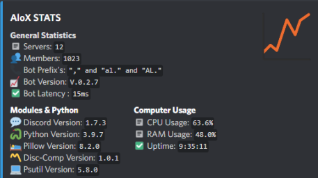
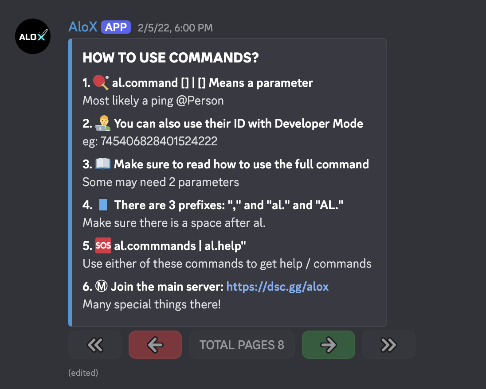

# 🤖 Alox Bot

A feature-rich Discord bot serving 1,000+ members with fun commands, utilities, image manipulation, and more.

---




## ✨ Features

- **Fun Commands**: Hack, tic-tac-toe, fight, love calculator, memes, rock-paper-scissors
- **Math Commands**: Basic arithmetic operations and odds calculator
- **Image Manipulation**: Avatar display, burn, slap, cry, wanted posters, and more
- **Search Commands**: Google, YouTube search, UTC timezone
- **Utility Commands**: AFK status, polls, purge, role creation, whois lookup
- **Giphy Integration**: Send GIFs for various actions
- **Interactive UI**: Button-based paginated help menu

---

## 🎮 Command Prefixes

```
al.  |  AL.  |  Al.  |  ,
```

---

## 📦 Commands

| Category    | Commands                                                                         |
| ----------- | -------------------------------------------------------------------------------- |
| **Fun**     | `hack`, `tictactoe`, `place`, `fight`, `match`, `numguess`, `meme`, `ban`, `rps` |
| **Math**    | `add`, `sub`, `div`, `mult`, `odds`                                              |
| **Image**   | `ugly`, `wanted`, `hideface`, `burn`, `slap`, `cry`, `textimg`, `avatar`         |
| **Search**  | `google`, `youtube`, `utc`                                                       |
| **Utility** | `afk`, `unafk`, `whois`, `docs`, `say`, `makerole`, `poll`, `purge`              |
| **Giphy**   | `gif`, `kill`, `boop`                                                            |
| **Other**   | `creator`, `ping`, `stats`, `uptime`, `help`                                     |

---

## 🛠️ Tech Stack

- Python
- discord.py
- discord-components (button interactions)
- Giphy API
- aiohttp

---

## 📦 Setup

### 1. Clone the repo

```bash
git clone https://github.com/NPX2218/alox-bot.git
cd alox-bot
```

### 2. Install dependencies

```bash
pip install -r requirements.txt
```

### 3. Create a `.env` file

```
TOKEN=your_discord_bot_token
GIPHY_API_KEY=your_giphy_api_key
```

### 4. Run the bot

```bash
python main.py
```

---

## 👨‍💻 Author

**Neel Bansal**
